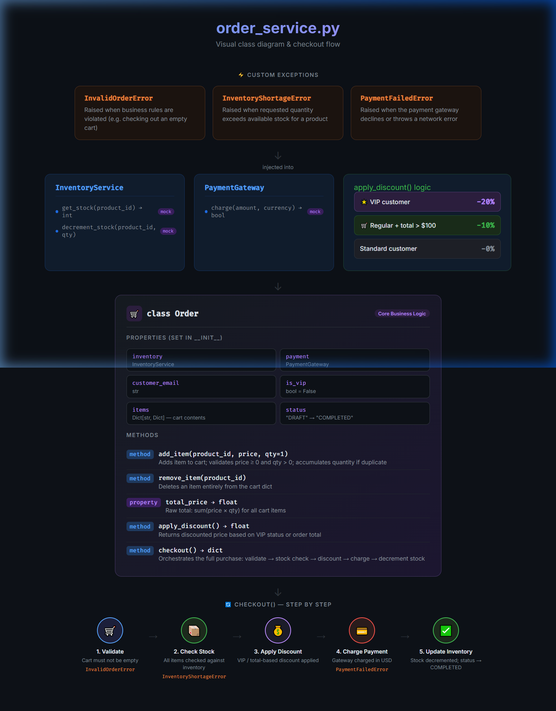

# 🚀 Antigravity Order Engine

Antigravity Order Engine, Python tabanlı gelişmiş bir sipariş işleme ve yönetim sistemidir. Bu proje, karmaşık iş mantıklarını (indirimler, stok kontrolü, ödeme entegrasyonu) temiz ve sürdürülebilir bir yapıda sunar.

Ayrıca, sistem mimarisini ve işlem akışını görselleştiren interaktif bir HTML dashboard içermektedir.

## ✨ Özellikler

- **Gelişmiş İndirim Mantığı:** 
  - VIP müşteriler için otomatik %20 indirim.
  - 100$ üzeri standart alışverişlerde %10 indirim.
- **Entegre Stok Yönetimi:** Her sipariş öncesi otomatik stok kontrolü ve işlem sonrası otomatik stok düşümü.
- **Güvenli Ödeme Akışı:** Ödeme ağ geçidi entegrasyonu ve hata yönetimi.
- **Özel Hata Yönetimi:** `InventoryShortageError`, `PaymentFailedError` ve `InvalidOrderError` ile detaylı hata takibi.
- **Görsel Mimari Dashboard:** Projenin sınıf yapısını ve checkout akışını gösteren modern HTML arayüzü.

## 🛠️ Teknolojiler

- **Backend:** Python (Typing, OOP)
- **Frontend (Görselleştirme):** HTML5, Vanilla CSS, Inter & Fira Code Fontları
- **Mimari:** Dependency Injection, Interface-based design

## 📁 Proje Yapısı

- `order_service.py`: Ana iş mantığı, sınıf tanımları ve checkout akışı.
- `order_visual.html`: Projenin görselleştirilmiş mimari şeması.
- `CLOUD_SETUP.md`: Google Cloud (TryGCP) bağlantı rehberi.
- `app.yaml`: Google App Engine yapılandırma dosyası.
- `assets/`: Proje ekran görüntüleri ve medya dosyaları.

## 🚀 Kurulum ve Kullanım

1. Depoyu klonlayın:
   ```bash
   git clone https://github.com/MirayTepe/antigravity-order-engine.git
   ```

2. Python dosyalarını incelemek için:
   ```bash
   python order_service.py
   ```

3. Görsel dashboard'u görüntülemek için `order_visual.html` dosyasını herhangi bir tarayıcıda açın.

4. Google Cloud bağlantısı için `CLOUD_SETUP.md` dosyasındaki adımları takip edin.

## 📸 Ekran Görüntüleri

### Görsel Mimari ve Checkout Akışı


---
*Bu proje Antigravity AI tarafından geliştirilmiştir.*
